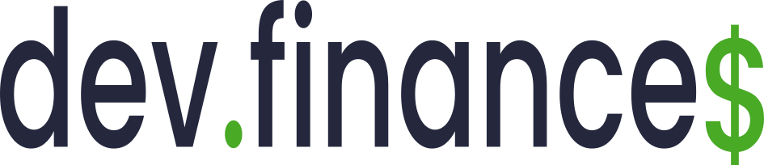

[](LICENSE)


## :information_source: O Projeto
Dev Finances é uma aplicação web que auxilia o usuário no controle de suas despesas. O projeto foi desenvolvido durante a maratona discover da Rocketseat,  essa versão foi implentanda com [Next JS](https://nextjs.org) - diferente do proposto na maratona - para praticar meus conhecimentos acerca do framework.

✔ [Visite clicando aqui](https://devfinances-nine.vercel.app/)


## 📌Conceitos que coloquei em prática

- Contextos com UseContext, CreateContext

- Component Level CSS

- Manuseio de dados em Local Storage

- Configuração de Loaders

## 💻 Rodando localmente

Para rodar o Dev Finances localmente em modo de desenvolvimento você deve:

```
git clone https://github.com/Fernanda-Kipper/DevFinances_NextJS.git project_name
cd project_name
npm install
npm run-script dev
```

No local de npm você pode utilizar o package manager de sua preferência
