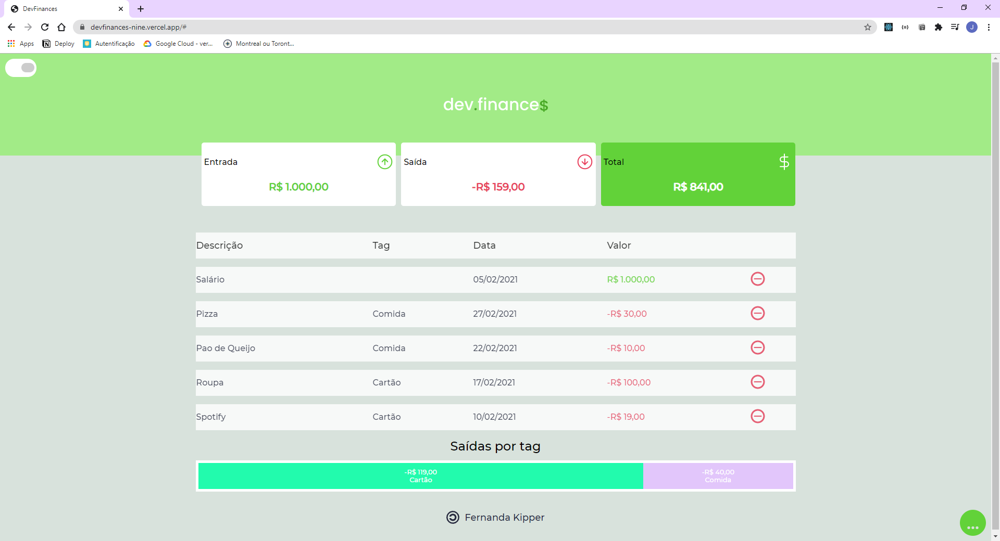
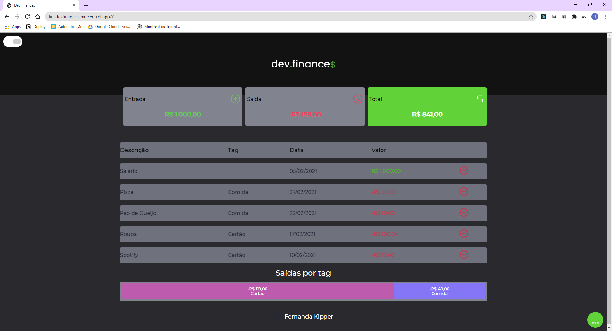

<h1 align="center"></h1>

<p align="center">
 <a href="#project">Projeto</a> •
 <a href="#tech">Tecnologias</a> • 
 <a href="#build">Construção</a> • 
 <a href="#clone">Clone</a> • 
 <a href="#license">License</a>
</p>

<h2 id="project" >Dev Finances 2.0</h2>

Dev Finances é uma aplicação web que auxilia o usuário no controle de suas despesas. O projeto foi desenvolvido durante a maratona discover da Rocketseat,  essa versão foi implentanda com [Next JS](https://nextjs.org) - diferente do proposto na maratona - para praticar meus conhecimentos acerca do framework.

<h3 align="center"><a href="https://devfinances-nine.vercel.app/">💻 Visite clicando aqui</a></h3>

<p align="center">
  
   
</p>

<h2 id="tech" >Tecnologias</h2>

- Next JS

- React JS

- JavaScript

- HTML e CSS

<h2 id="build" >Construção</h2>

Para a construção do projeto apliquei alguns conceitos de JavaScript como manuseio de dados em Local Storage e outros mais específicos do mundo React e Next JS como contextos com UseContext, CreateContext, mudanças de estados com Hooks, React Memo para evitar re-renderizações desnecessárias, configuração de Loaders e component Level CSS.

### Levando para Outro nível 🚀

Na construção do App adicionei funcionalidades a mais daquelas propostas na maratona:

- Adicionei a opção de mudar de tema, Light ou Dark mode, e as preferências do usuário ficam salvas localmente.
- Botão para excluir todas transações
- Separação dos Gastos por Tags, exemplo: Comida.
- Gráfico para o usuário visualizar seus gastos dividos por Tags - linkei com a funcionalidade anterior.

<h2 id="clone" >Clone</h2>

Para rodar o Dev Finances localmente em modo de desenvolvimento você deve:

```
git clone https://github.com/Fernanda-Kipper/DevFinances_NextJS.git project_name
cd project_name
npm install
npm run-script dev
# Acesso o localhost
http://localhost:3000/
```
No local de npm você pode utilizar o package manager de sua preferência

<h2 id="license">Licença</h2>

Esse projeto está sob a licença [MIT](LICENSE)
